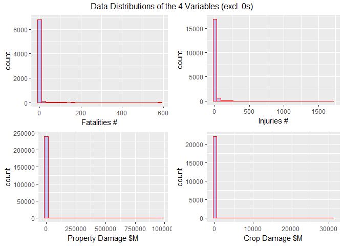
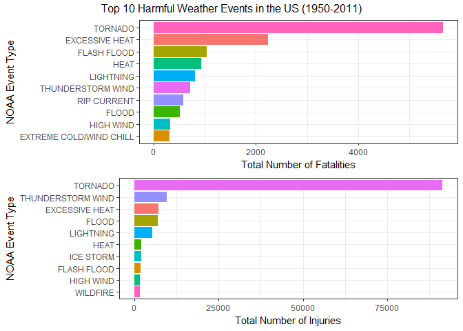
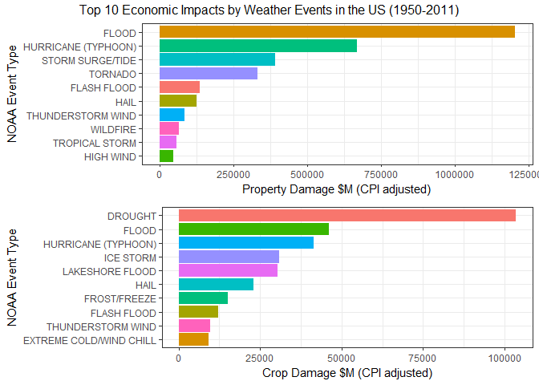

# Reproducible Research: Peer Assessment 2
William Thong  
`r format(Sys.time(), "%d %B, %Y")`  


## Introduction
Storms and other severe weather events can cause both public health and economic problems for communities and municipalities. Many severe events can result in fatalities, injuries, and property damage, and preventing such outcomes to the extent possible is a key concern.

This project involves exploring the U.S. National Oceanic and Atmospheric Administration's (NOAA) storm database. This database tracks characteristics of major storms and weather events in the United States, including when and where they occur, as well as estimates of any fatalities, injuries, and property damage.

## Synopsis
In this analysis, we seek to address the following research questions,

1. Across the United States, which types of events (as indicated in the EVTYPE variable) are most harmful with respect to population health?  
2. Across the United States, which types of events have the greatest economic consequences?     

We will need to perform data pre-processing, including data cleansing, transformation, create derived variables and etc, before we can perform analysis using the the 'tidy' data set.

## Data Processing
This section covers each step and component of the data processing activities. The objective is to finalise a 'tidy' data set for analysis.

### Load required libraries
We first load the libraries required for this analysis.  While it is subjective, my programming preference is to load libraries I would be using upfront in a single code chunk.

```r
# Load libraries
library(data.table)  # for fread function 
library(dplyr)       # for data wrangling
library(ggplot2)     # for plotting
library(gridExtra)   # for arranging plots into grid
library(lubridate)   # for date time functions
library(R.utils)     # for uncompressing bz2 function
library(quantmod)    # for USA CPI (inflation) data
library(psych)       # for descriptive stats
library(knitr)       # for producing nicer table output using kable function
```

### Check availability of source files in working directory
We check the working directory and existence of source files. If not, download and/or uncompress accordingly.

```r
# Ensure all files are in the intended working dir else use setwd() to set
#setwd("your working directory") # <--Uncomment to use if required.
#getwd() # <--Uncomment to use if required.

# Check, download & unzip raw data file if required
fileUrl <- "https://d396qusza40orc.cloudfront.net/repdata%2Fdata%2FStormData.csv.bz2"
if (!file.exists("./StormData.csv.bz2")){
  download.file(fileUrl,"./StormData.csv.bz2", mode="wb")
}
if (!file.exists("./StormData.csv")) {
    bunzip2("./StormData.csv.bz2","./StormData.csv", remove = FALSE)
}
```

### Import the data into R
The raw data file is imported in R and a temporary data set is created with required variables.

```r
# Import raw file into R
if(!exists("dfTemp1")) {
        dfTemp1 <- fread("StormData.csv", sep=",", header=TRUE, data.table=FALSE, stringsAsFactors=FALSE)
}
```

```
## 
Read 15.5% of 967216 rows
Read 34.1% of 967216 rows
Read 51.7% of 967216 rows
Read 65.1% of 967216 rows
Read 78.6% of 967216 rows
Read 82.7% of 967216 rows
Read 86.8% of 967216 rows
Read 91.0% of 967216 rows
Read 902297 rows and 37 (of 37) columns from 0.523 GB file in 00:00:11
```

```r
# Create a df with required vars as we do not need all the imported variables.
dfTemp2 <- dfTemp1 %>% 
        select(REFNUM, EVTYPE , STATE, COUNTY, COUNTYNAME, BGN_DATE, END_DATE, FATALITIES, INJURIES, PROPDMG, PROPDMGEXP, CROPDMG, CROPDMGEXP)
```

### Transform date variables
We convert date variables into proper date variables.


```r
# Convert date variables to date format
dfTemp2$BGN_DATE <- mdy_hms(dfTemp2$BGN_DATE)
dfTemp2$END_DATE <- mdy_hms(dfTemp2$END_DATE)
```

### Translate the impact values
The economic impact to property and crop damages were not recorded as 'as is' values. We need to translate them into actual dollar values. In addition, we need to adjust these translated values with yearly inflation rates from 1950 to 2011 so that we can view the economic impacts in real terms.

```r
# Do CPI data part
# Get the min year from dfTemp2$BGN_DATE for CPI base year
YearMin <- as.character(year(min(dfTemp2$BGN_DATE)))

# Get CPI (Inflation Rate) data using quantmod package
getSymbols("CPIAUCSL", src='FRED')
```

```
## [1] "CPIAUCSL"
```

```r
# Compute the yearly averages and adjustment rates from base year
cpi.avg <- apply.yearly(CPIAUCSL, mean)
cpi.adj.rate <- cpi.avg/as.numeric(cpi.avg[YearMin])

# Create a DF from the xts object
dfCPI <- data.frame(date=index(cpi.adj.rate), coredata(cpi.adj.rate), row.names=NULL)
dfCPI <- dfCPI %>% mutate(year.cpi = year(date))

# Do weather data part
# Function for translating value exponent
Exp.Translate <- function(e) {
    # h -> hundred, k -> thousand, m -> million, b -> billion
    if (e %in% c('h', 'H'))
        return(2)
    else if (e %in% c('k', 'K'))
        return(3)
    else if (e %in% c('m', 'M'))
        return(6)
    else if (e %in% c('b', 'B'))
        return(9)
    else if (e %in% c('', '-', '?', '+'))
        return(0)
    else if (!is.na(as.numeric(e))) # if a digit
        return(as.numeric(e))
    else {stop("Invalid exponent value.")}
}

# Translate the exponents
PROPDMG.EXP <- data.frame(sapply(dfTemp2$PROPDMGEXP, FUN=Exp.Translate))
colnames(PROPDMG.EXP) <- c("PROPDMG.EXP")
CROPDMG.EXP <- data.frame(sapply(dfTemp2$CROPDMGEXP, FUN=Exp.Translate))
colnames(CROPDMG.EXP) <- c("CROPDMG.EXP")

# Compute the CPI adjusted damage values into a new DF
dfTemp3 <- dfTemp2 %>% 
        bind_cols(PROPDMG.EXP) %>% 
        bind_cols(CROPDMG.EXP) %>% 
        mutate(year.cpi = year(BGN_DATE)) %>% 
        left_join(dfCPI, by="year.cpi") %>% 
        mutate(PROPDMG.VAL = PROPDMG*(10**PROPDMG.EXP)*CPIAUCSL) %>% 
        mutate(CROPDMG.VAL = CROPDMG*(10**CROPDMG.EXP)*CPIAUCSL) %>%
        mutate(TTL.ECONOMIC.IMPACT = PROPDMG.VAL+CROPDMG.VAL) %>% 
        mutate(TTL.FATALITY.INJURY = FATALITIES+INJURIES) %>%
        select(1:9,19:22)
```
### Map the historical event types to modern NOAA event types
There were 890 unique event types in the imported data while there are 48 modern NOAA event types according to the NWSI 10-1605 (AUGUST 17, 2007) Storm Event Table.  A mapping exercise is required to map these historical event types to the modern event types.     

Initial mapping attempts with fuzzy text matching techniques from the `stringdist` package were not successful due to the quality of the free-text values recorded over the decades.  As there are only 890 historical event type values to be mapped to 48 modern event type values, a look-up table was created for mapping via a manual 'eyeballing' exercise.  This lookup file is available on the GitHub repository mentioned in the **GitHub Repository** section below for forking.    

The output from this step is the 'tidy' data set **dfTidy**, which will be used for analysis and concludes the activities required for data pre-processing.

```r
# Remove leading, trailing and duplicated white spaces
dfTemp3$EVTYPE <- trimws(toupper(dfTemp3$EVTYPE))

# Import lookup table
dfNOAA.Lookup <- read.csv("STORM_NOAA_LOOKUP.csv", header=TRUE, stringsAsFactors=FALSE)

# Match event types to the modern event types
dfTidy <- dfTemp3 %>%
        left_join(dfNOAA.Lookup, by=c("EVTYPE"="STORM.EVTYPE"))

# Remove unused objects to free up memory
rm(dfTemp1, dfTemp2, dfTemp3)
```

## Analysis
Before we tackle the 2 research questions, we performed data analysis to understand the shapes and distributions of the data using the 4 quantiative variables i.e. `FATALITIES, INJURIES, PROPDMG.VAL and CROPDMG.VAL`.

### Proportions of 0s
Not every weather event results in adverse health and economic impact, hence we would want to know the proportions of 0 impacts relative to the all the events that had occured.

```r
# Find proportions of 0 values
AllCount <- length(dfTidy$REFNUM)
ObsName <- c("Proportions Percent")
FATALITIES <- (length(subset(dfTidy, dfTidy$FATALITIES <= 0)$FATALITIES)/AllCount)*100
INJURIES <- (length(subset(dfTidy, dfTidy$INJURIES <= 0)$INJURIES)/AllCount)*100
PROPDMG <- (length(subset(dfTidy, dfTidy$PROPDMG.VAL <= 0)$PROPDMG.VAL)/AllCount)*100
CROPDMG <- (length(subset(dfTidy, dfTidy$CROPDMG.VAL <= 0)$CROPDMG.VAL)/AllCount)*100
dfZeros <- data.frame(FATALITIES,INJURIES,PROPDMG,CROPDMG)
dfZeros <- cbind(ObsName, dfZeros)
kable(dfZeros, digits=2)
```


ObsName                FATALITIES   INJURIES   PROPDMG   CROPDMG
--------------------  -----------  ---------  --------  --------
Proportions Percent         99.23      98.05     73.49     97.55
     
Results showed there were high proportions of 0s in the 4 quantitative variables.

### Summary Statistics
In lieu of the high proportions of 0s mentioned earlier, we performed summary statistics and distribution plots with exclusions of 0s to understand the data distributions of the 4 quantitative variables.

```r
# Subset data where values > 0
sub1 <- subset(dfTidy, dfTidy$FATALITIES>0)$FATALITIES
sub2 <- subset(dfTidy, dfTidy$INJURIES>0)$INJURIES
sub3 <- (subset(dfTidy, dfTidy$PROPDMG.VAL>0)$PROPDMG.VAL)/1000000
sub4 <- (subset(dfTidy, dfTidy$CROPDMG.VAL>0)$CROPDMG.VAL)/1000000

# Run quick summary stats for the 4 required variables
dfSummStats <- rbind(describe(sub1),
                     describe(sub2),
                     describe(sub3),
                     describe(sub4))
varName <- c("FATALITIES","INJURIES","PROPDMG.VAL ($M)","CROPDMG.VAL ($M)")
dfSummStats <- cbind(varName, dfSummStats) %>% 
        select(1,3:6,9:14)
kable(dfSummStats, row.names=FALSE, digits=2)
```


varName                  n    mean        sd   median   min        max      range     skew    kurtosis     se
-----------------  -------  ------  --------  -------  ----  ---------  ---------  -------  ----------  -----
FATALITIES            6974    2.17      8.43     1.00     1      583.0      582.0    49.53     3259.05   0.10
INJURIES             17604    7.98     38.08     2.00     1     1700.0     1699.0    20.47      627.28   0.29
PROPDMG.VAL ($M)    239174   13.71   2093.26     0.07     0   963291.8   963291.8   417.04   188513.14   4.28
CROPDMG.VAL ($M)     22099   16.07    331.81     0.11     0    30800.0    30800.0    73.80     6488.57   2.23

```r
# Plot histogram to view data distributions
q1 <- qplot(sub1,
      geom="histogram",
      xlab = "Fatalities #",
      fill=I("blue"), 
      col=I("red"), 
      alpha=I(.2))

q2 <- qplot(sub2,
      geom="histogram",
      xlab = "Injuries #",
      fill=I("blue"), 
      col=I("red"), 
      alpha=I(.2))

q3 <- qplot(sub3,
      geom="histogram",
      xlab = "Property Damage $M",
      fill=I("blue"), 
      col=I("red"), 
      alpha=I(.2))

q4 <- qplot(sub4,
      geom="histogram",
      xlab = "Crop Damage $M",
      fill=I("blue"), 
      col=I("red"), 
      alpha=I(.2))

grid.arrange(q1, q2, q3, q4, ncol=2, nrow =2, top="Data Distributions of the 4 Variables (excl. 0s)")
```

<!-- -->
          
The summary statistics and distribution plots indicated that the data distributions of the 4 variables are highly right-skewed and there were many observations of extreme high values.  

The decision is to aggregate the quantitive measures by Event Type and filter for Top 10 event types that have the most impact.

### Create Top 10 data sets by Event Types
We create Top 10 data sets for Fatalities, Injuries, Property Damage and Crop Damage after aggregations by Event Types.

```r
# Create the top 10 event types for Fatalities
dfTop10.FATALITIES <- dfTidy %>% 
        group_by(NOAA.EVTYPE) %>% 
        summarise(TOTAL.FATALITIES = sum(FATALITIES)) %>% 
        arrange(desc(TOTAL.FATALITIES)) %>% 
        top_n(10, TOTAL.FATALITIES) %>% 
        ungroup()

# Create the top 10 event types for Injuries
dfTop10.INJURIES <- dfTidy %>% 
        group_by(NOAA.EVTYPE) %>% 
        summarise(TOTAL.INJURIES = sum(INJURIES)) %>% 
        arrange(desc(TOTAL.INJURIES)) %>% 
        top_n(10, TOTAL.INJURIES) %>% 
        ungroup()

# Create the top 10 event types for PROPDMG.VAL
dfTop10.PROPDMG.VAL <- dfTidy %>% 
        group_by(NOAA.EVTYPE) %>% 
        summarise(TOTAL.PROPDMG.VAL = sum(PROPDMG.VAL)/1000000) %>% 
        arrange(desc(TOTAL.PROPDMG.VAL)) %>% 
        top_n(10, TOTAL.PROPDMG.VAL) %>% 
        ungroup()

# Create the top 10 event types for CROPDMG.VAL
dfTop10.CROPDMG.VAL <- dfTidy %>% 
        group_by(NOAA.EVTYPE) %>% 
        summarise(TOTAL.CROPDMG.VAL = sum(CROPDMG.VAL)/1000000) %>% 
        arrange(desc(TOTAL.CROPDMG.VAL)) %>% 
        top_n(10, TOTAL.CROPDMG.VAL) %>% 
        ungroup()
```


## Results
### 1. Across the United States, which types of events (as indicated in the EVTYPE variable) are most harmful with respect to population health?   

```r
g1 <- ggplot(data=dfTop10.FATALITIES,
             aes(x=reorder(NOAA.EVTYPE, TOTAL.FATALITIES), y=TOTAL.FATALITIES, fill=NOAA.EVTYPE)) +
    geom_bar(stat="identity") +
    coord_flip() +
    ylab("Total Number of Fatalities") +
    xlab("NOAA Event Type") +
    theme_bw() +
    theme(legend.position="none")

g2 <- ggplot(data=dfTop10.INJURIES,
             aes(x=reorder(NOAA.EVTYPE, TOTAL.INJURIES),  y=TOTAL.INJURIES, fill=NOAA.EVTYPE)) +
    geom_bar(stat="identity") +
    coord_flip() + 
    ylab("Total Number of Injuries") +
    xlab("NOAA Event Type") +
    theme_bw() +
    theme(legend.position="none")

grid.arrange(g1, g2, top="Top 10 Harmful Weather Events in the US (1950-2011)")
```

<!-- -->
     
The plots indicated the Top 10 harmful event types with respect to the population health. **Tornadoes** topped the charts as the most harmful with the most fatalites and injuries. In both cases, the number of fatalities and injuries due to Tornadoes are more than 2 times than the rest of the 9 event types in each chart. The plots also indicated that injuries tend to be much higher than fatalities.

### 2. Across the United States, which types of events have the greatest economic consequences? 

```r
g3 <- ggplot(data=dfTop10.PROPDMG.VAL,
             aes(x=reorder(NOAA.EVTYPE, TOTAL.PROPDMG.VAL), y=TOTAL.PROPDMG.VAL, fill=NOAA.EVTYPE)) +
    geom_bar(stat="identity") +
    coord_flip() +
    ylab("Property Damage $M (CPI adjusted)") +
    xlab("NOAA Event Type") +
    theme_bw() +
    theme(legend.position="none")

g4 <- ggplot(data=dfTop10.CROPDMG.VAL,
             aes(x=reorder(NOAA.EVTYPE, TOTAL.CROPDMG.VAL),  y=TOTAL.CROPDMG.VAL, fill=NOAA.EVTYPE)) +
    geom_bar(stat="identity") +
    coord_flip() + 
    ylab("Crop Damage $M (CPI adjusted)") +
    xlab("NOAA Event Type") +
    theme_bw() +
    theme(legend.position="none")

grid.arrange(g3, g4, top="Top 10 Economic Impacts by Weather Events in the US (1950-2011)")
```

<!-- -->
     
The plots indicated the Top 10 event types with high econonic consequences. **Floods** caused the highest economic damage to properties while **Droughts** caused the highest crop damage in millions of real dollars. The plots also indicated that the value of property damages is much higher than that of crop damages.

## GitHub Repository
This analysis is completed with R.  For reproducibility, you can fork and download the R code from this [GitHub Repository](https://github.com/lobbie/RepData_PeerAssessment2) 

## Session Information
Details from `sessionInfo` below,

```
## R version 3.3.2 (2016-10-31)
## Platform: x86_64-w64-mingw32/x64 (64-bit)
## Running under: Windows 10 x64 (build 14393)
## 
## locale:
## [1] LC_COLLATE=English_Australia.1252  LC_CTYPE=English_Australia.1252   
## [3] LC_MONETARY=English_Australia.1252 LC_NUMERIC=C                      
## [5] LC_TIME=English_Australia.1252    
## 
## attached base packages:
## [1] stats     graphics  grDevices utils     datasets  methods   base     
## 
## other attached packages:
##  [1] knitr_1.15.1      psych_1.6.12      quantmod_0.4-7   
##  [4] TTR_0.23-1        xts_0.9-7         zoo_1.7-14       
##  [7] R.utils_2.5.0     R.oo_1.21.0       R.methodsS3_1.7.1
## [10] lubridate_1.6.0   gridExtra_2.2.1   ggplot2_2.2.1    
## [13] dplyr_0.5.0       data.table_1.10.0
## 
## loaded via a namespace (and not attached):
##  [1] Rcpp_0.12.8      plyr_1.8.4       highr_0.6        tools_3.3.2     
##  [5] digest_0.6.11    evaluate_0.10    tibble_1.2       gtable_0.2.0    
##  [9] lattice_0.20-34  DBI_0.5-1        yaml_2.1.14      parallel_3.3.2  
## [13] stringr_1.1.0    rprojroot_1.1    grid_3.3.2       R6_2.2.0        
## [17] foreign_0.8-67   rmarkdown_1.3    magrittr_1.5     backports_1.0.4 
## [21] scales_0.4.1     htmltools_0.3.5  assertthat_0.1   mnormt_1.5-5    
## [25] colorspace_1.3-2 labeling_0.3     stringi_1.1.2    lazyeval_0.2.0  
## [29] munsell_0.4.3
```

